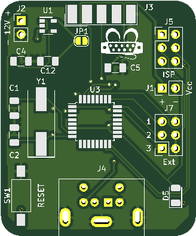

# PONTAG
## Introduction
PONTAG is a board that converts a PS/2 mouse into a serial mouse that can be used on old IBM PC and clones, which lacked PS/2 ports but had plenty of serial interfaces (especially if expansion cards are installed).

## Features & Limitations
* Supports 3 buttons+wheel PS/2 mouses and converts their protocol to RS232 serial usable on old PC systems.
* The board requires an external power supply between 8V and 12V to power the MCU and mouse
* Detects PS/2 mouses with wheel and without and notifies the user via LED (5 fast blinks for a normal mouse, 20 fast blinks for a mouse with wheel)
* Can be configured for various resolutions and mouse protocols by pushing mouse buttons

### Configuration
The board can be configured during powerup by pressing the mouse keys. The configuration will be retained for all subsequent boots.
To configure the board you must keep the mouse button pressed during a reset/bootup. A sequence of **15 slow blinks** will notify the user of the accepted command, then the board will be reset with the new configuration.

* **Left mouse button pressed**: Switches between simple Microsoft protocol and Microsoft protocol with wheel (**DEFAULT:** MS+Wheel)
* **Right mouse button pressed**: Switches mouse resolution, switching between 1, 2, 4 or 8 counts per mm traveled (**DEFAULT:** 4 counts per mm)
* **Both buttons pressed**: Resets the board to defaults

### Extra Header
The board supports some special options that can be toggled via external header, shorting the corrisponding pin to GND.

* **Pin 1**: If shorted, forces the use of the simple Microsoft protocol (2 buttons, no wheel), regardless of what is stored in the EEPROM.
* **Pin 2**: If jumpered, the board will skip the PS/2 intellimouse wheel activation sequence
* **Pin 3**: The board will enter debug mode, and start printing debug strings on the serial port. It will NOT work as a mouse.

## Supported protocols
PONTAG emulates a Microsoft 3-buttons Wheel serial mouse by default and transmits the `0x4D 0x5A 0x40 0x00 0x00 0x00` detection string when RTS signal is toggled.

The boards are tested with [CuteMouse](http://cutemouse.sourceforge.net/).

## Credits

- Some footprints are taken from [4x1md](https://github.com/4x1md/kicad_libraries)
- Took and modified PS/2 code from [sensi.org](http://sensi.org/~svo/%5Bm%5Douse/doc/html/index.html) and [mouse1351](https://github.com/svofski/mouse1351)
